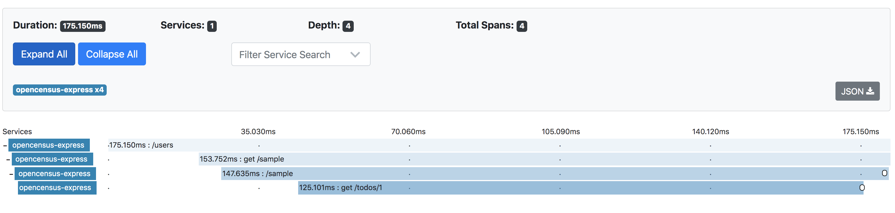

# Overview

OpenCensus HTTP Instrumentation allows the user to automatically collect trace data and export them to the backend of choice (we are using Zipkin for this example), to give observability to distributed systems.

> NOTE: Please ensure that you start the OpenCensus tracer BEFORE initializing your express app, if you want to enable automatic tracing for built-in plugins (HTTP in this case). https://github.com/census-instrumentation/opencensus-node#plugins

## Installation

```sh
$ # from this directory
$ npm install
```

Setup [Zipkin Tracing](https://opencensus.io/codelabs/zipkin/#0)

## Run the Application

 - Run the server

   ```sh
   $ # from this directory
   $ npm start
   ```

 - Execute the request

    Please visit http://localhost:3000/users to submit the request.

 - Viewing traces

    On navigating to the Zipkin UI at http://localhost:9411

    

## Useful links
- For more information on OpenCensus, visit: <https://opencensus.io/>
- To checkout the OpenCensus for Node.js, visit: <https://github.com/census-instrumentation/opencensus-node>
- For more information on Zipkin, visit https://zipkin.io/

## LICENSE

Apache License 2.0
